<picture>
  <source media="(prefers-color-scheme: dark)" srcset="./dark.svg">
  <source media="(prefers-color-scheme: light)" srcset="./light.svg">
  
</picture>

 

##  About

Java Full Stack Developer based in Dharmapuri, Tamil Nadu, currently working as a Shopify Website Developer at **Huemind Digital Marketing**. Focused on building full-stack web applications and Shopify storefronts.

-  B.Sc. IT, Karpagam Academy of Higher Education
-  Java Full Stack certification, Besant Technologies
-  Currently building: **Opalline**, a jewelry billing ERP synced with Shopify
-  Currently sharpening: Shopify theme architecture and Storefront/Admin API integrations
-  Portfolio: [chandruuuu.vercel.app](https://chandruuuu.vercel.app)

---

##  Tech Stack

** Languages**

** Frontend**

** Backend**

** Databases**

** Tools**

** Shopify**

** Auth & Payments**

---

##  Current Stack

| Area | What I'm using |
|---|---|
| Job | Shopify Liquid, Online Store 2.0 themes, Storefront/Admin API |
| opal line (ERP) | NestJS, Prisma, PostgreSQL, React + TypeScript |
| Java track | Spring Boot, JWT auth, MySQL |

---

##  GitHub Stats

  
  

  

